# Creating a 2D Platformer using Unreal Engine

## **Some prerequisites**

It is recommended you go throught getting started with unreal engine guide before doing this guide.

### **Paper ZD**

Open your epic game's launcher and head on over to Fab, which is the fourth option on the side bar 

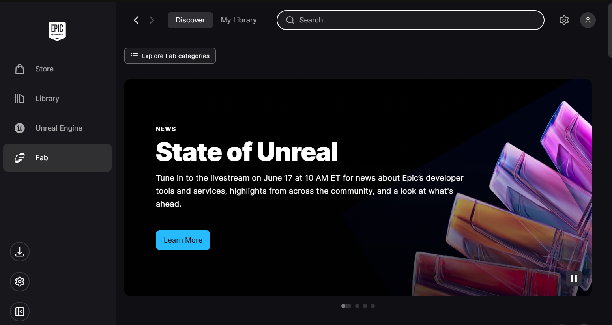

Then search for **Paper ZD** and open it up
and then click on **add to library** 
After that click on install plugin, select the engine version you are working with and that should be first thing done.

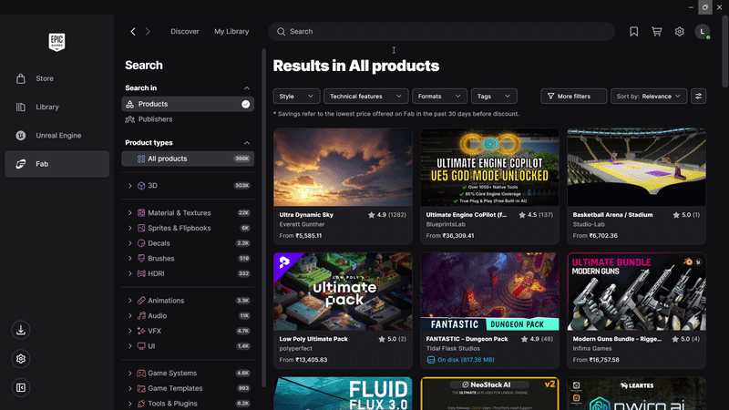

### **Installing Plugins**

Create a new project, tweak your settings as you like

Then follow the following steps to enable these two plugins,

Click on **Edit** --> **Search Paper**, and then enable **Paper2D** and **PaperZD**
Then restart the engine

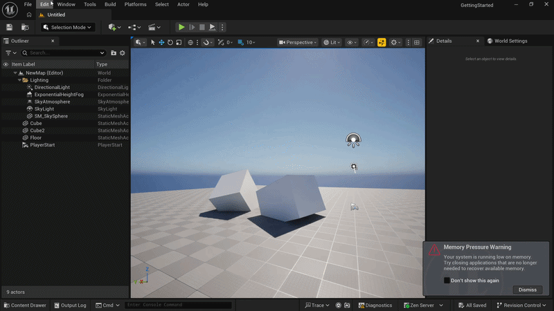

### **Recording Time**

All time recorded for unreal engine blueprints or the engine itself is to be done by using **Lapse** since unreal engine does not have native hackatime support.

You can **sync time** to **hackatime** through lapse

Check out: lapse.hackclub.com

## Getting 2D assets

A 2D game needs 2D assets, and dont we all LOVE free 2D assets.
The best website to get them are itch.io

You can click the link:
[Free 2D assets](https://itch.io/game-assets/free/tag-2d)

Although i used the following assets if you wish to follow along 1:1 with me

- **Tileset**: https://incolgames.itch.io/dungeon-platformer-tile-set-pixel-art
- **Character**: https://legnops.itch.io/red-hood-character

They are all completely free to download and play around with.

## Setting Up the Project

Although unreal engine does have a 2D template, we will learn from scratch by using an empty project.

First we will create a new map, set it as the default map for playing and opening levels. We have already discussed how to do this in the getting started guide. You can always refer back to it if you don't understand anything

Then we want to set up our project folder in the following way for ease of use

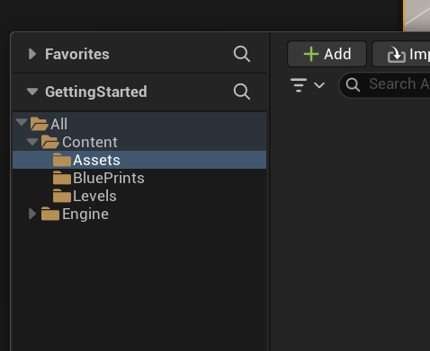

Here, 
- **Assets**: This contains all our textures, models, sprites etc.
- **Blueprints**: This contains all the blueprints you will code
- **Maps**: Self explanatory, All the maps you create will go here

## Creating Redhood

Both the RedHood Character and the dungeon level are in sprite sheets. We will discuss how to use both of them in this section

But first we have to import them and prepare them.

### **Importing and Preparing Sprites**

In the itch.io section after clicking on download, we will proceed to downloads and install the **Idle and Alter.zip** file

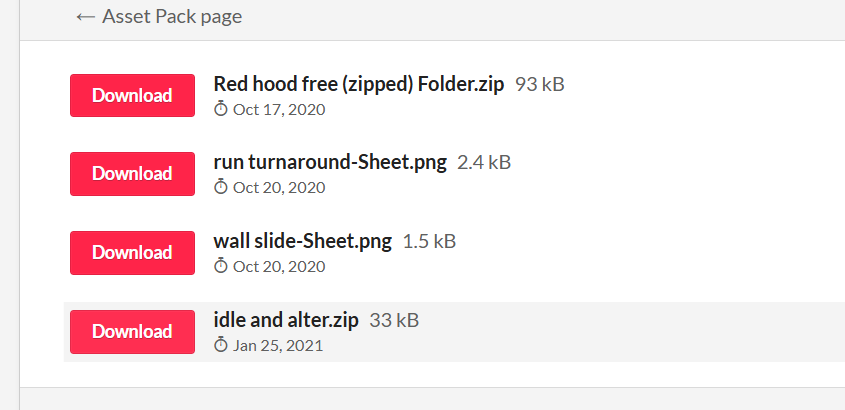

Then we will create a folder called RedHood in assets inside our project

We will extract the **Idle and Alter.zip** that and import them by opening the Content Drawer and clicking on **import**

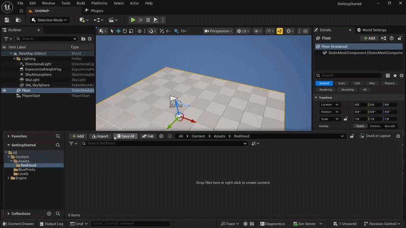

If we open any one them, we can see its pretty blurry. There's an easy way to fix that
We can just go to the **details panel** on the right

Look under **Level of Detail**

Go to **texture group** and search for **"2D Pixels (Unfiltered)"**

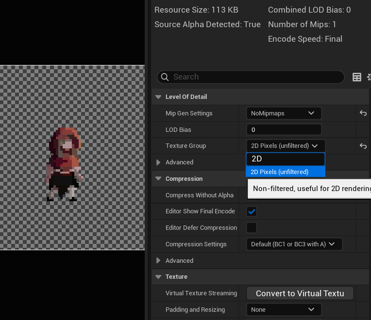

This would instantly improve the blurriness of the texture
**Press CTRL + S to save your progress**

Now to perform this action in bulk, we can select multiple texture groups by **holding SHIFT** and selecting using **Left Mouse Button**

Then Right Clicking, Going to **Asset Actions** --> **Edit Selection in Property Matrix**

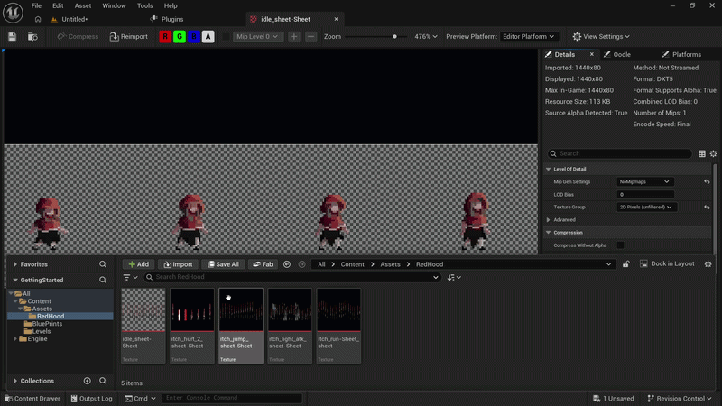

First select all the items by either selecting them by **holding shift** or pressing **CTRL + A**

Here, expand the Level of Detail drop down and change texture group from **World** to **2D Pixels** then press **CTRL + A**

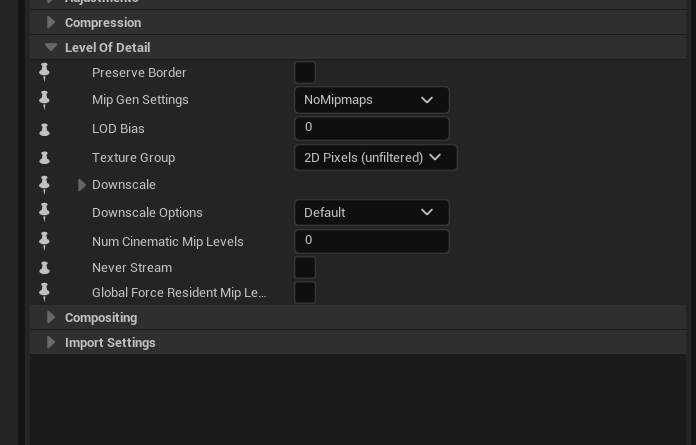

Next up what we wanna do is extract these Sheets to sprites.

Before doing that we will clean up our folder structure a little better again.

Now under RedHood we will divide the folders into 5 parts, **Idle**, **Jump**, **Run**

Here each folder represents a seperate tilemap, since we wont be covering combat in this, you can go and delete **hurt** and **light atk** if you want

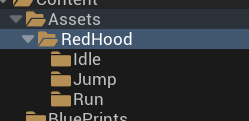

Then we can go ahead, click and drop each Texture map into its respective folder as follows

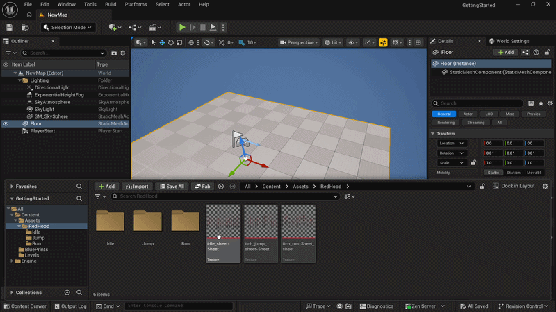

Now we can convert each of these into a sprite, this is done by right clicking a texture file, going under **sprite actions** and clicking on **extract sprites**

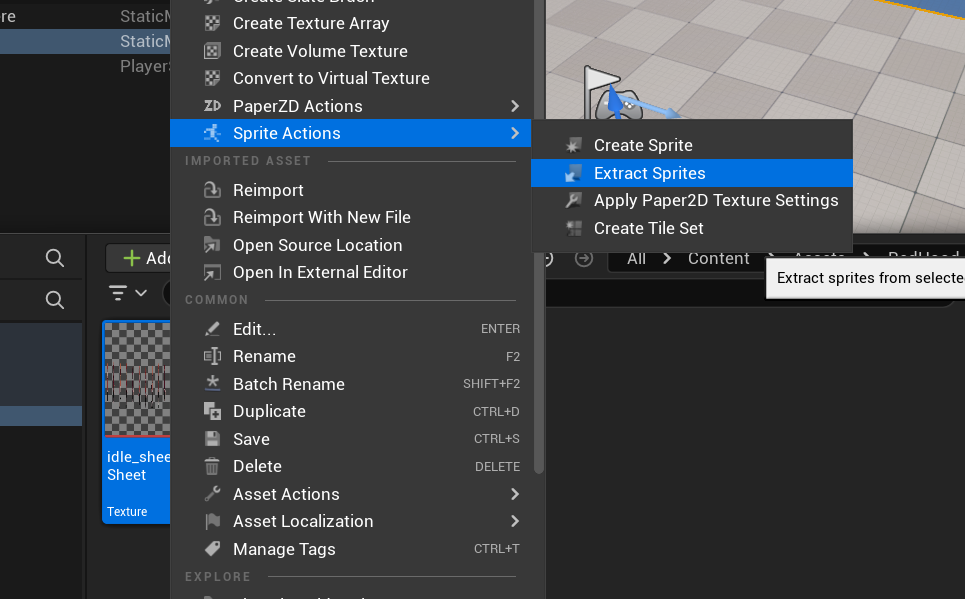

Now a window like this should pop up

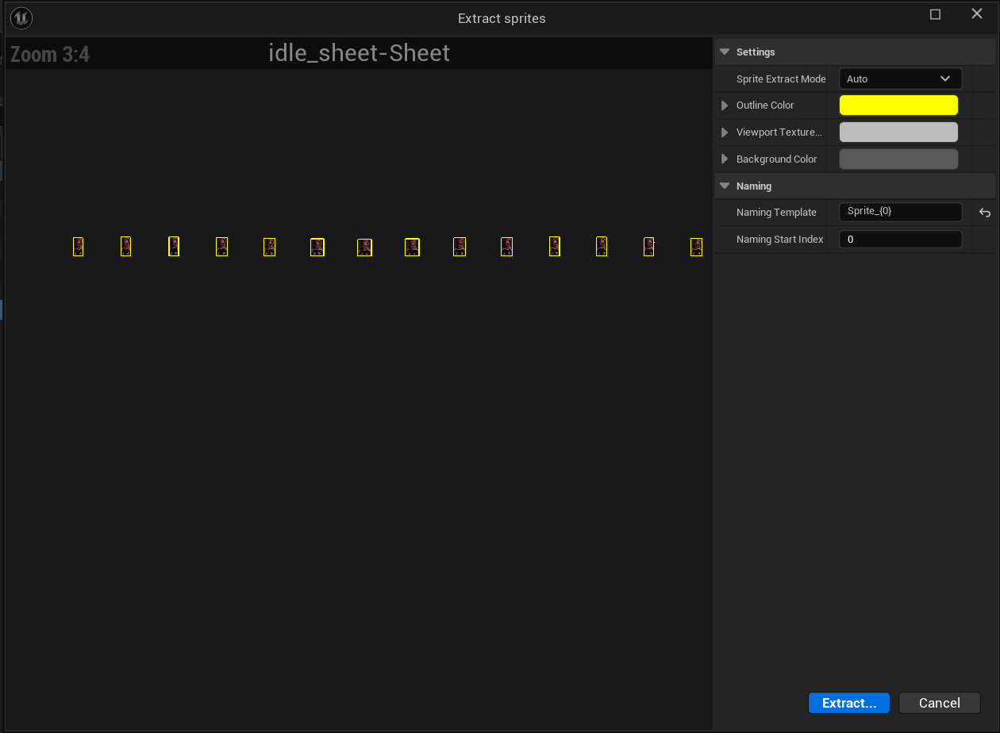

We do not want it to auto extract sprites for us because we want each sprite to be roughly the same size, to fix that you wanna go under **Sprite Extract mode** and select **Grid**

Now a seperate dropdown by the name of **Grid** should come up. 

Here we have to tweak the cell height and width. 
An easy way to get that is:

- To get cell width, count the number of items in a row and then divide it by the default length
- To get cell height divide, count the number of rows and divide it by the default height

You dont have to use a calculator, you can simply go to Cell Width enter box and just add a /(number of items you counted) infront of it

and then click extract

For eg. this is how I did it for the idle animation sheet.

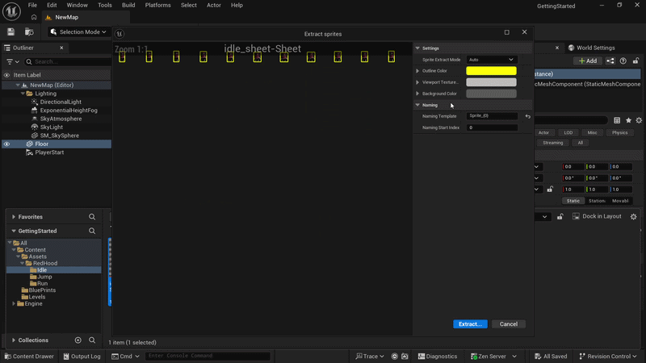

By doing this we convert a sprite sheet into individual sprites, where each sprite is a frame in the animation

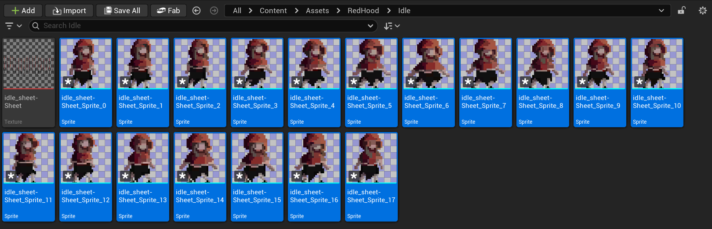
 
We want to go ahead and do this with the rest of the sprite sheets we have until we have sprites for all 3 states.

### Incase your are unable to figure out

- For idle sprite sheet, divide the width by 18
- For jump sprite sheet, divide the width by 19
- For running sprite sheet, divide the width by 24

Click on extract and lets now convert them to animations

